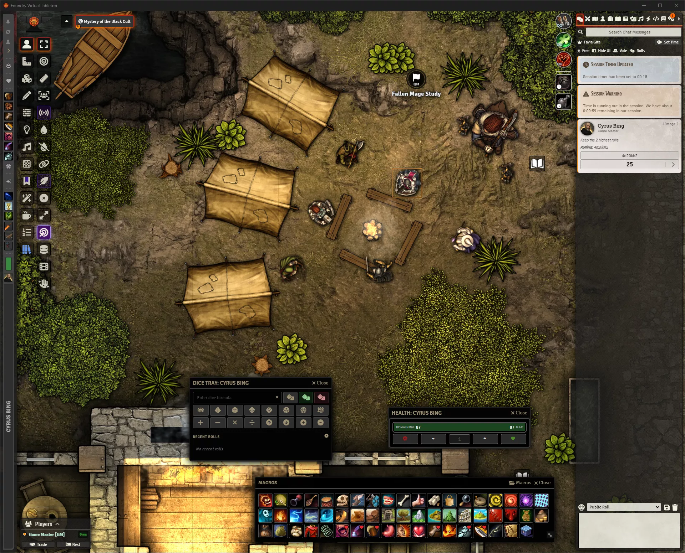
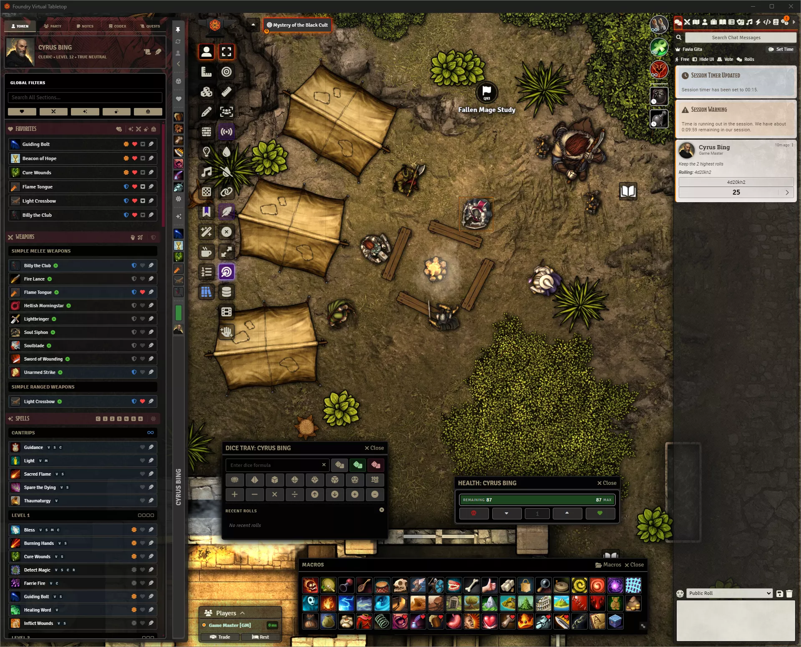
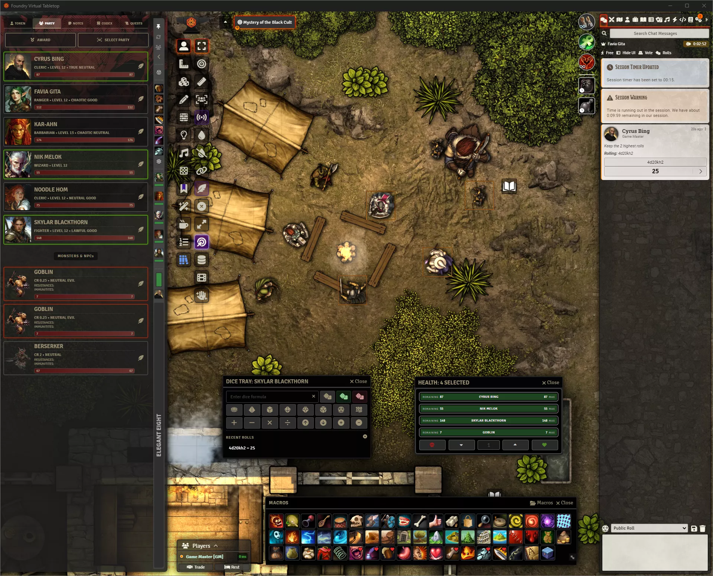
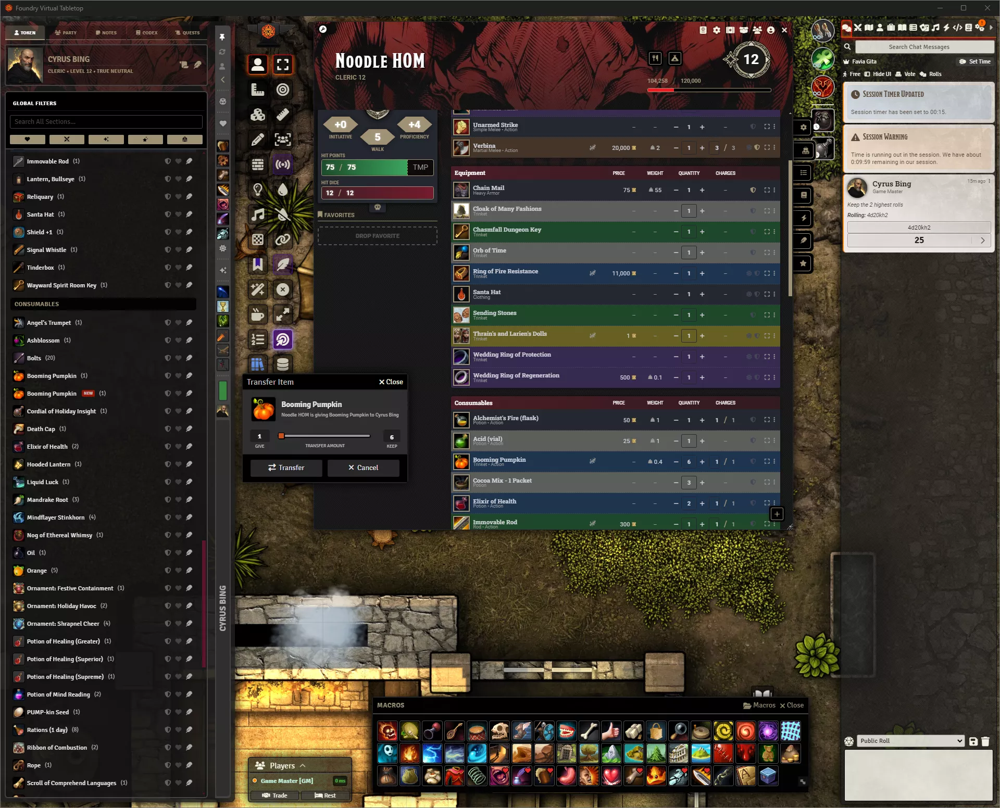

# Coffee Pub Squire

## Disclaimer

This is a personal project created for my FoundryVTT games to introduce various quality-of-life features and functions. 

If you stumble upon this repository and find it useful, feel free to try it out! However, please note that this project is developed for personal use, and I make no guarantees regarding stability, compatibility, or ongoing support.

**Use at your own risk.** I am not responsible for any issues, data loss, or unexpected behavior resulting from using this project.

Squire puts a character's own tools within reach: a sliding tray that follows the token you have selected, with spells, weapons, inventory, favourites and health where you can get at them without opening a sheet. Part of the Coffee Pub suite of modules.

## IMPORTANT NOTICE

**Squire 12.1.14 was the last build compatible with FoundryVTT v12.** Everything since targets v13 and later, and there are no plans to maintain the v12 line.

**Quests, the Codex, and Notes have moved out of Squire.** Quests and the Codex now live in [Coffee Pub Librarian](https://github.com/Drowbe/coffee-pub-librarian); Notes moved to [Coffee Pub Blacksmith](https://github.com/Drowbe/coffee-pub-blacksmith). Existing data was migrated rather than dropped — install Librarian to keep using them. Squire's charter is narrower now, and deliberately so: *help me understand what my character can do, and let me do it with ease.*

## Visual Showcase

### **Main Interface**

*The sliding tray interface provides quick access to all character tools*

### **Player Tools**

*Character management, health tracking, and combat tools*

### **Party Management**

*Party coordination, participant management, and group statistics*

### **Item Transfers**

*GM-mediated item transfers with request/accept/reject workflow*

## Features

### **Core Character Management**
- **Sliding tray interface** that appears on the left side of the screen
- **Automatic character detection** and token-based selection
- **Comprehensive character panels** with real-time data synchronization

### **Combat & Equipment**
- **Spell management** with:
  - Spell slot tracking and management
  - Prepared spell filtering and organization
  - Spell favorites and quick access
  - Component tracking and requirements
  - Spell usage and cooldown management
- **Weapon management** with:
  - Equipped weapon filtering and organization
  - Weapon favorites and quick access
  - Ammunition tracking
  - Damage calculation and display
- **Inventory management** with:
  - A currency section alongside the item categories, with a send flow for handing coins over
  - Item categorization and filtering
  - Weight and quantity tracking
  - Item favorites and quick access
  - Drag & drop functionality
- **Item hover cards** — hovering an item in Favourites, Inventory, Spells, Weapons or Features brings up the dnd5e system's own rich tooltip, the same card its character sheet shows

### **Favourites**
- **Two-way sync with the dnd5e character sheet.** Favourite something in the tray and it appears on the sheet; favourite it on the sheet and it appears in the tray. Removals on either side are honoured, and activity, effect, and resource favourites the sheet owns are left untouched.
- **Quick access from the collapsed handle**, with a configurable limit

### **Sheet Upkeep**
- **Character sheet cleanup**, behind a broom in the Character Sheet title bar. It previews everything before it acts, every row can be unticked, and it reports what it did rather than closing behind a toast:
  - **Consolidate currency** to the fewest coins, through the dnd5e system's own conversion, with the total shown before and after so "same money, fewer coins" is checkable rather than promised
  - **Link items to their compendium entry**, so an item records what it is a copy of and can be repaired later if the entry behind it changes
  - **Merge duplicate stacks**, with strict identity rules, anything skipped explained in plain language, and a one-step undo
  - **Players can request it** on characters they own. They never write to their own sheet — applying sends the plan to the GM, who reviews the same rows in the same window and decides
- **Inventory warnings** for weapons with no usable ammunition. The owning player sees the warning on their own characters; clicking it asks the GM rather than adding anything
- **Statblock warnings** for NPCs, with optional automatic repair

### **Tools & Utilities**
- **Standalone Blacksmith Micro dice tool** with fixed controls and a compact, independently scrolling recent-roll history
- **Standalone Blacksmith Micro health tool** with real-time HP tracking, healing controls, multi-token operations, Light/Dark/Glass themes, and an optional menubar launcher
- **Condition management** with visual indicators and quick application
- **Standalone Blacksmith Micro macro tool** with execution, favorites, reordering, and drag-and-drop assignment
- **Character Summary panel** combining labeled combat stats, interactive ability checks/saves, and level progression in one compact card
- **Compendium search** with a configurable access rung for players — open, ask the GM, or off

### **Party & Social Features**
- **Party panel** with character status overview and party statistics
- **Party toolbar** for the GM and party leader: award **Experience**, call a **Vote**, and **Deploy** or **Clear** the party, all through Blacksmith
- **Party reputation** shown with the scene it belongs to, since reputation is stored per scene. The bar is a balance rather than a progress bar — the track carries the whole −100..+100 spectrum and a marker shows where the party sits. GMs get ±1 / ±5 controls
- **Item transfer system** with:
  - GM-mediated transfers
  - Request/accept/reject workflow
  - Chat-based notifications
  - Transfer history tracking

### **Customization & Settings**
- **Theme system** with Dark, Light, and Custom options
- **Panel visibility** — show or hide the GM details, character summary, and party stats panels
- **Handle configuration** — conditions, favourites, and health bar on the collapsed handle
- **Per-user preferences**, including excluding specific users from the tray entirely

### **Technical Features**
- **FoundryVTT v13** (verified 13, maximum 14)
- **Performance optimized** with efficient data handling
- **Hook system** with centralized event management
- **Error handling** with comprehensive logging and recovery
- **Data persistence** with robust state management

## Installation

1. Inside Foundry VTT, select the Game Modules tab in the Configuration and Setup menu.
2. Click the Install Module button and enter the following URL: https://github.com/Drowbe/coffee-pub-squire/releases/latest/download/module.json
3. Click Install and wait for installation to complete.

## Dependencies

- [Coffee Pub Blacksmith](https://github.com/Drowbe/coffee-pub-blacksmith) — required, 13.12.2 or later
- [socketlib](https://github.com/manuelVo/foundryvtt-socketlib) — required
- Foundry VTT v13 (verified 13, maximum 14)
- Built for the DnD5e system

Optional: [Coffee Pub Librarian](https://github.com/Drowbe/coffee-pub-librarian) for quests and the codex, which Squire used to provide.

## Usage

After installation and enabling the module:

### **Getting Started**
1. The tray will automatically appear when you load into a world
2. If you own a token, it will automatically select that character
3. Click the handle to expand/collapse the tray
4. Use the pin button to keep the tray open

### **Character Management**
5. **Combat Tools**: Access spells, weapons, and inventory through dedicated panels
6. **Health & Status**: Monitor HP and conditions in real-time from the handle or optional Health menubar tool
7. **Favorites System**: Bookmark frequently used items, spells, and features — the dnd5e character sheet stays in step, both ways
8. **Item Cards**: Hover any item for the system's full card, without opening a sheet
9. **Dice Tray**: Open the compact Blacksmith Micro dice tool from the handle or menubar; its recent-roll history scrolls independently
10. **Character Summary**: Optionally show one compact tray card for level, initiative, speed, armor, proficiency, abilities, and experience

### **Sheet Upkeep**
11. **Cleanup**: Click the broom in the Character Sheet title bar to consolidate coins, link items to their compendium entries, and merge duplicate stacks. Nothing is written until you review the plan
12. **Requests**: As a player, cleanup sends its plan to the GM for approval rather than applying it
13. **Warnings**: Watch for the ammunition badge on weapons with nothing to fire; clicking asks the GM to restock

### **Party**
14. **Party Management**: Coordinate with other players and see group statistics
15. **Party Toolbar**: Award experience, call a vote, deploy or clear the party
16. **Reputation**: Track how the party stands on the current scene
17. **Item Transfers**: Facilitate item exchanges between characters

### **Customization**
18. **Theme Selection**: Choose from Dark, Light, or Custom themes
19. **Layout Options**: Set tray width and top/bottom offsets
20. **User Preferences**: Set individual settings for your playstyle
21. **Integration**: Configure Coffee Pub Blacksmith API settings

## Settings

### **Appearance & Layout**
- **Color Theme**: Dark, Light, or Custom
- **Tray Width**, **Top Offset**, **Bottom Offset**: Fit the tray to your screen
- **Default Tab**: Which panel the tray opens on
- **Show Party Tab**, **Show GM Details Panel**, **Show Character Summary Panel**, **Show Party Stats Panel**

### **The Handle**
- **Show Conditions in Handle**, **Show Favorites in Handle**, **Show Health Bar in Handle**
- **Maximum Handle Favorites**

### **Sheet Upkeep**
- **Players Can Request Cleanup**: Let players run cleanup on characters they own; applying sends the plan to the GM to approve
- **Inventory Warnings**: Flag player characters whose weapons have no usable ammunition
- **Show Statblock Warnings**, **Repair Statblocks Automatically**: The NPC equivalents; automatic repair is NPC-only by design
- **Ammunition Restock Quantity**: How much a GM hands over when approving a restock
- **Auto-Favorite NPC Statblock Content**, **Also Ignore These Actions**, **Generic Actions to Keep**

### **Items & Transfers**
- **GM Approves Transfers** and **Transfer Request Timeout**
- **Confirm Deleting Items Worth More Than**: A guard against deleting something valuable by accident
- **Let Players Use Compendiums**: Open, ask the GM, or off

### **User Preferences**
- **Excluded Users**: Hide the tray for specific users
- **Remember Prepared Spells / Equipped Weapons / Equipped Inventory Filter**: Keep each panel's filter between sessions
