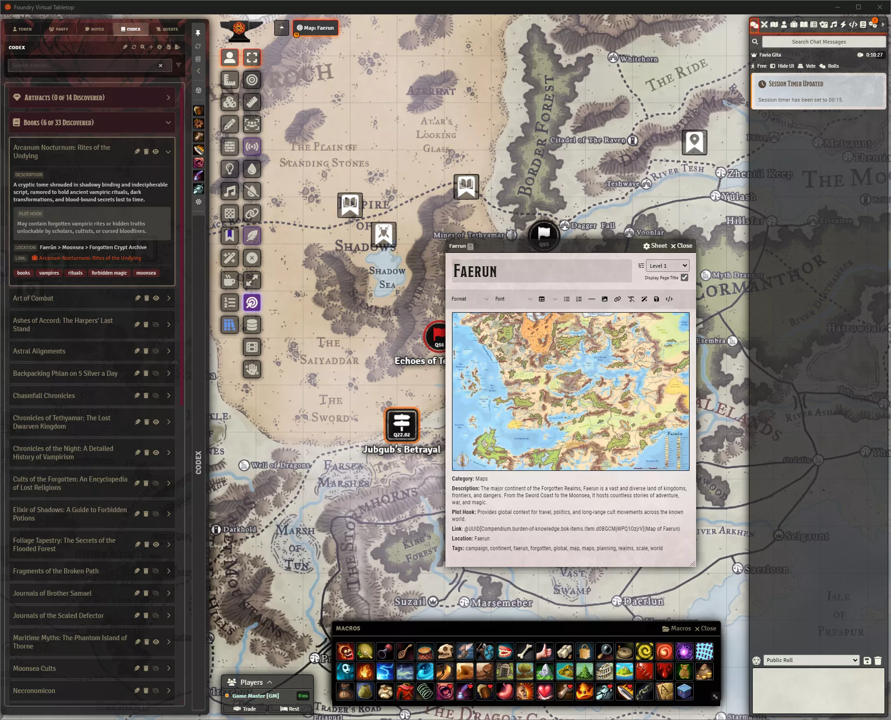
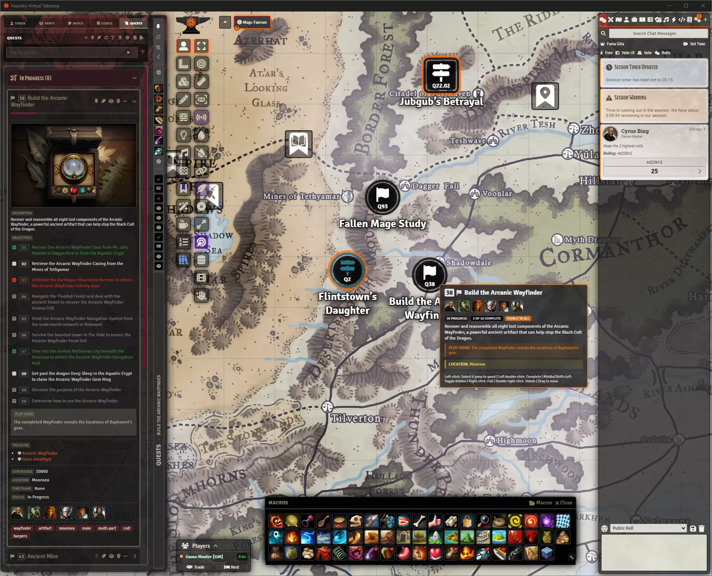

# Coffee Pub Squire

## Disclaimer

This is a personal project created for my FoundryVTT games to introduce various quality-of-life features and functions. 

If you stumble upon this repository and find it useful, feel free to try it out! However, please note that this project is developed for personal use, and I make no guarantees regarding stability, compatibility, or ongoing support.

**Use at your own risk.** I am not responsible for any issues, data loss, or unexpected behavior resulting from using this project.

A comprehensive FoundryVTT module that provides an extensive suite of character management tools, quest systems, and quality-of-life features through an intuitive sliding tray interface. Part of the Coffee Pub suite of modules.

## Visual Showcase

### **Main Interface**

*The sliding tray interface provides quick access to all character tools*

### **Player Tools**

*Character management, health tracking, and combat tools*

### **Party Management**

*Party coordination, participant management, and group statistics*

### **Notes & Journal**

*Quick access to journal entries and notes with live content updates*

### **Codex & World Building**

*Enhanced codex creation with drag & drop functionality and smart form auto-population*

### **Quest Management**

*Comprehensive quest creation, editing, and organization with task tracking*

### **Item Transfers**

*GM-mediated item transfers with request/accept/reject workflow*

## Features

### **Core Character Management**
- **Sliding tray interface** that automatically appears on the left side of the screen
- **Automatic character detection** and token-based selection
- **Comprehensive character panels** with real-time data synchronization

### **Combat & Equipment**
- **Spell management** with:
  - Spell slot tracking and management
  - Prepared spell filtering and organization
  - Spell favorites and quick access
  - Component tracking and requirements
  - Spell usage and cooldown management
- **Weapon management** with:
  - Equipped weapon filtering and organization
  - Weapon favorites and quick access
  - Ammunition tracking
  - Damage calculation and display
- **Inventory management** with:
  - Item categorization and filtering
  - Weight and quantity tracking
  - Item favorites and quick access
  - Drag & drop functionality

### **Tools & Utilities**
- **Integrated dice tray** for quick rolls and calculations
- **Health management** with real-time HP tracking and healing tools
- **Condition management** with visual indicators and quick application
- **Macro management** with customizable quick-access buttons
- **Experience tracking** with level progression monitoring

### **Quest & Adventure Management**
- **Comprehensive quest system** with:
  - Quest creation, editing, and organization
  - Task management with completion tracking
  - Progress visualization and status management
  - GM notes and player hints
  - Treasure and reward tracking
  - Participant management and party coordination
- **Scene pin system** with:
  - Quest pin placement on canvas
  - Objective-specific pin management
  - Visual quest state indicators
  - Pin visibility controls for GMs and players
- **Quest import/export** with:
  - JSON-based quest data transfer
  - Scene pin preservation
  - Progress state maintenance
  - Rich data preservation (GM notes, treasure, etc.)

### **Codex & World Building**
- **Enhanced codex system** with:
  - Drag & drop entity creation
  - Smart auto-population of form fields
  - Category and tag management
  - Image handling and organization
  - Location and plot hook management
- **Journal integration** with:
  - Notes panel for quick access
  - Live content updates
  - Multi-page journal support
  - Edit and open functionality

### **Party & Social Features**
- **Party management** with:
  - Character status overview
  - Party statistics and coordination
  - Participant management for quests
- **Item transfer system** with:
  - GM-mediated transfers
  - Request/accept/reject workflow
  - Chat-based notifications
  - Transfer history tracking

### **Customization & Settings**
- **Theme system** with Dark, Light, and Custom options
- **Layout customization** with tray positioning and behavior
- **User preferences** with individual settings per user
- **Accessibility features** with configurable UI elements
- **Integration settings** for Coffee Pub Blacksmith API

### **Technical Features**
- **FoundryVTT v12+ compatibility** with v13 readiness
- **Performance optimized** with efficient data handling
- **Hook system** with centralized event management
- **Error handling** with comprehensive logging and recovery
- **Data persistence** with robust state management

## Installation

1. Inside Foundry VTT, select the Game Modules tab in the Configuration and Setup menu.
2. Click the Install Module button and enter the following URL: https://github.com/Drowbe/coffee-pub-squire/releases/latest/download/module.json
3. Click Install and wait for installation to complete.

## Dependencies

- [Coffee Pub Blacksmith](https://github.com/Drowbe/coffee-pub-blacksmith)
- Foundry VTT (Version 12 compatible, V13 ready)
- DnD5e System (Version 4.0+)

## Usage

After installation and enabling the module:

### **Getting Started**
1. The tray will automatically appear when you load into a world
2. If you own a token, it will automatically select that character
3. Click the handle to expand/collapse the tray
4. Use the pin button to keep the tray open

### **Character Management**
5. **Combat Tools**: Access spells, weapons, and inventory through dedicated panels
6. **Health & Status**: Monitor HP, conditions, and character stats in real-time
7. **Favorites System**: Bookmark frequently used items, spells, and features
8. **Dice Tray**: Use the integrated dice tray for quick rolls and calculations

### **Quest & Adventure**
9. **Quest Management**: Create, edit, and organize quests with task tracking
10. **Scene Pins**: Place quest pins on canvas for visual quest management
11. **Progress Tracking**: Monitor quest completion and participant progress
12. **Import/Export**: Transfer quests between worlds with full data preservation

### **World Building**
13. **Codex System**: Create and manage world entities with drag & drop
14. **Journal Integration**: Access notes and journal entries through the tray
15. **Party Management**: Coordinate with other players and manage group activities
16. **Item Transfers**: Facilitate item exchanges between characters

### **Customization**
17. **Theme Selection**: Choose from Dark, Light, or Custom themes
18. **Layout Options**: Customize tray position and behavior
19. **User Preferences**: Set individual settings for your playstyle
20. **Integration**: Configure Coffee Pub Blacksmith API settings

## Settings

### **Appearance & Layout**
- **Tray Position**: Left side of the screen (configurable)
- **Open on Hover**: Automatically expand the tray when hovering
- **Theme Selection**: Choose between Dark, Light, or Custom themes
- **Custom Theme Colors**: Define your own color scheme and branding
- **Move Foundry Toolbar**: Add padding to accommodate the tray
- **Move UI When Pinned**: Shift the UI when the tray is pinned open

### **Quest & Adventure**
- **Quest Pin Visibility**: Control quest pin display for GMs and players
- **Auto-show Pins**: Automatically display pins when dragging quests to canvas
- **Pin Labels**: Toggle quest pin title visibility
- **Quest Import/Export**: Configure quest data transfer settings

### **User Preferences**
- **Auto-add Party Members**: Automatically include party members in quests
- **Excluded Users**: Hide the tray for specific users
- **Individual Settings**: Per-user customization options
- **Accessibility**: Configurable UI elements and interactions

### **Integration & Performance**
- **Coffee Pub Blacksmith**: API integration settings and configuration
- **Performance Options**: Optimize for different hardware capabilities
- **Debug Logging**: Configure logging levels for troubleshooting
- **Data Persistence**: Control how user preferences are saved

## License

[MIT License](LICENSE)

## Support

For support, bug reports, or feature requests:
- Create an issue on [GitHub](https://github.com/Drowbe/coffee-pub-squire/issues)
- Contact me on Discord: drowbe 

## Changelog

See [CHANGELOG.md](CHANGELOG.md) for a detailed list of all version updates and feature releases.

## Development Status

The module is actively maintained and regularly updated. See [TODO.md](TODO.md) for current development priorities and [ROADMAP.md](ROADMAP.md) for planned features. 