# Getting Started with Squire

**Audience:** anyone who has just installed Squire and wants to use it at the table.

Your first five minutes: what appears on screen, how to open and pin the tray, how to point it at a
character, and the handful of things you will do with it every session. Every control on the settings
page is in [the settings guide](userguide-settings.md).

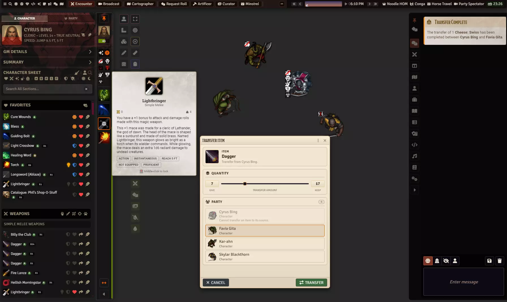

## What Squire needs

Coffee Pub Blacksmith, installed and enabled, and socketlib. Squire will not run without them.
Everything below assumes the D&D 5e system.

## What appears when you enable it

A narrow vertical strip down the left edge of the screen, over the top of Foundry's own left toolbar.
That strip is the tray handle, and it is there whether the tray is open or closed. On it, top to
bottom:

- A thumbtack, which pins the tray open.
- The character's portrait and name, and a bar under it carrying their current hit points. If you own
  the character, clicking that bar opens the Health window.
- Their conditions, two to a row, with a sparkles button above them -- **Add or Remove Conditions** --
  that opens the status effects window. When there are more conditions than fit, the button carries
  the count.
- Your favourites, as icons.
- A left-right arrow -- **Handle Width** -- which switches the closed handle between its narrow and
  wide shapes. It only changes the closed handle; open, the strip is always narrow.
- A caret at the foot, which opens and closes the tray. Foundry keeps its own sidebar collapse
  control in the same place.

The conditions grid, the favourites and the health bar can each be turned off on the settings page.

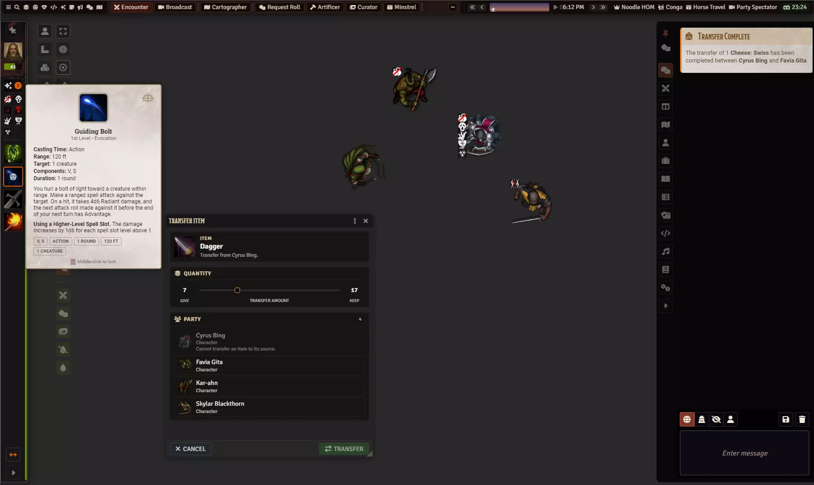

Down the outer edge of the handle runs a thin coloured bar. That is the same hit points again, filled
from the bottom and coloured by how bad things are. It is the one readout that stays visible when the
tray is open.

## Open and close the tray

Click the caret at the foot of the handle. Click it again to close.

Two settings change this, and both are yours alone rather than the world's. **Open Tray on Hover**
opens the tray when your mouse crosses the handle and closes it shortly after you leave. **Collapse
Tray When You Click Away** closes an unpinned tray a moment after you click elsewhere; **Tray Collapse
Delay** is how many seconds that moment lasts.

To stop it closing at all, click the thumbtack. A pinned tray stays open, ignores hover, and pushes
Foundry's interface across to make room rather than covering it.

**Tray Width** sets how wide the open tray is, in pixels. It is a slider on the settings page and it
is yours, not the world's -- your screen, your number.

## Point the tray at a character

The tray shows one character at a time.

**As a GM:** select a token on the canvas. The tray follows your selection, and it follows it
strictly -- deselect everything and you get the empty tray back rather than the last character you
looked at. Opening a character sheet also switches the tray to that character.

**As a player:** the tray finds a character for you. It prefers the last one you picked, then the
character assigned to your user, then any character you own. Selecting one of your tokens switches to
it.

**If you own more than one character**, a row of portrait chips appears, and clicking one switches the
tray to it. Characters with a token on the scene you are viewing come first, then a divider, then the
ones who are elsewhere -- picking one of those switches the tray without moving anything on the
canvas. Squire remembers the choice, so a scene change or a deleted token comes back to the character
you chose rather than guessing again.

If nothing is selected and you own nothing, the tray says so.

## The two tabs

At the top of the open tray: **Character** and **Party**. The Party tab can be turned off from the
settings page, and turning it off needs a reload.

## The Character tab

Stacked down the tray, in this order:

1. **The character panel** -- portrait, name, class and level, alignment, speeds.
2. **GM Details** -- GM only, and players never see it whatever the setting says.
3. **Summary** -- one compact card carrying level, initiative, speed, armour, proficiency, the
   ability scores and experience. The ability scores are clickable: they roll the check or the save.
   Its setting is called Show Character Summary Panel; the panel header on screen says Summary.
4. **Character Sheet** -- a thin strip carrying the search box, the section tabs and the filter bar.
   This is the control strip for everything below.
5. Whichever section the open tab shows. **Favorites** has a view of its own -- the heart in the
   Character Sheet strip.

### Do something with an item

Click the die on a row's image. For anything with an activity that makes the attack, casts the spell,
drinks the potion -- the normal thing. For a container it opens the bag instead, because a backpack
has nothing to roll.

Hover a row and the D&D 5e system's own item card appears, the same one the character sheet shows. You
do not have to open a sheet to read what something does. Middle-click the card to lock it open.

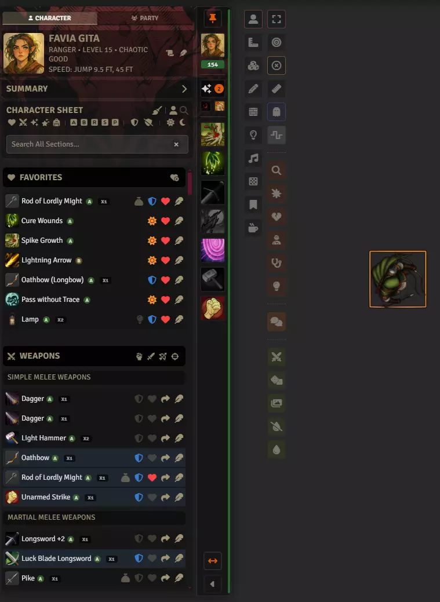

The Spells section groups by level and shows the slots you have left on each.

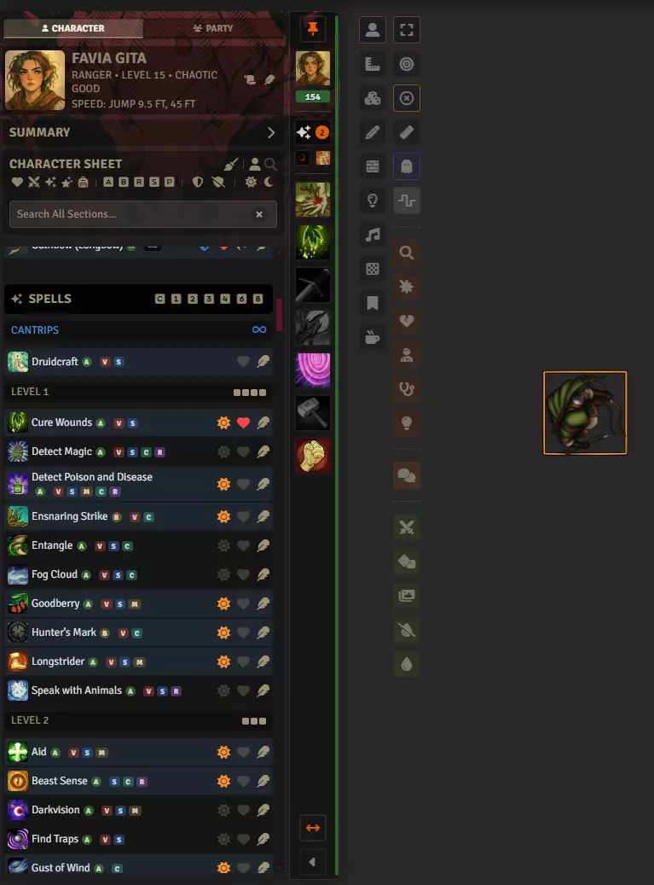

Inventory can be read as a flat list or grouped by container. The toggle is on the Inventory section's
own title bar, next to its category filters.

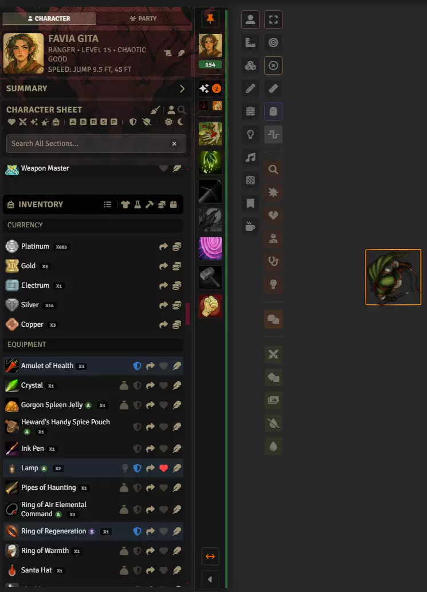

### Favourite something

Click the heart on a row. Click it again to remove it.

### Plan a set of gear

Above your favourites is **Builds**. The **+** in its header starts one and opens it: a figure of your
character surrounded by slots -- head, face, neck, back, chest, arms, hands, rings, hips, waist, feet,
and the three weapon slots along the bottom. Drag items from the tray into the slots to say what this
build is made of. The two circles beside the head hold a **portrait** and a **token** image. Click either to pick a picture, right-click to reset it. Until you set one, each shows what your character already uses. Right-click a gear slot to empty it; right-click a build's tile to open, duplicate or delete it. Duplicating is the quick way to try a variant -- the same set with one thing swapped -- without building it again from nothing. The foot of the window totals what the gear weighs.

If your character prepares spells, the build window is wider and carries a column for them: a set of
slots sized to exactly how many that class can prepare, with a running count. Drag spells in the same
way you drag gear. Multiclass casters get one block per class, since each prepares its own number.
Cantrips and your spell slots are shown beside the list for reference -- cantrips are always available
so there is nothing to choose, and a prepared spell is not tied to a particular slot, so neither is
something you fill in. Classes that know spells rather than preparing them get no such column.

Magic items glow in their slot, coloured by rarity, and anything needing attunement carries a gem --
lit if it is attuned, warm and hollow if it is not, which means it would do nothing if you wore this
set. The foot of the window totals the attunement the build would spend against what your character
has, so you can see at a glance whether the set actually fits.

Most slots will take anything you could wear or carry -- a helm, a cloak, a belt and a pair of boots
look identical to the game, so Squire does not pretend to tell them apart. The ones it *can* check, it
does: the ammo slots take ammunition, Both Hands takes a weapon, and nothing that is not a physical
object -- a spell, a feat, a class feature -- goes anywhere. If a slot turns
something down it says what it was expecting.

**A build is a plan, not a state.** Nothing in it changes what your character is actually wearing --
it is somewhere to work out a set of gear, not a switch that puts it on. Only items already on your
sheet can go in a slot, and if one later leaves your sheet the slot says so rather than quietly
emptying itself.

### Work with your favourites

The **heart in the Character Sheet strip** opens your favourites on their own: no tabs, no search box
and no filter bar, just the list and its **Clear All Favorites** button. The person icon beside the
heart goes back to the sheet. Squire opens on whichever of the two you were last in, and on favourites
the first time.

Favourites draw two ways, and the pair of icons at the right of the Favorites header switches between
them. **List** is the ordinary row, the same one every other section uses. **Tiles** is a grid of
squares, each one the item's own artwork with its name across the bottom and what it is under that --
"Weapon - 4 lb", or a spell's level. The controls sit top-right, and hovering a tile brings up the die,
exactly as hovering a row's picture does. Whichever you pick is remembered.

The icon beside those two sets the order, and shows which order you are in: **Manual** is the one you
arrange yourself, **Alphabetical** is by name, and **By Category** groups weapons, spells, feats and
gear in that order with names alphabetised inside each group, under headings like the ones the Weapons
and Inventory sections use. Sorting never disturbs your manual
order -- switch back to Manual and your arrangement is exactly as you left it. While a sort is on, the
move-up and move-down options leave the right-click menu, because they would be rearranging an order
you are not currently looking at.

Right-click a tile and open **Tile Size** to change how much room it takes: **1 x 1**, **2 x 1**,
**1 x 2** or **2 x 2**, width first.
Give the thing you reach for every round a big square and let the rest sit small around it. The same
menu carries the move-up and move-down options it always has.

Hovering an item's name shows Foundry's own card for it, in the tiles and in every list. The feather
shows the same card, so you can see what opening the sheet will give you before you click it.

Favourites are shared with the character sheet in both directions: favourite something in the tray and
it appears on the sheet, favourite it on the sheet and it appears in the tray, and removing it in
either place removes it in both. The activity, effect and resource favourites the sheet owns are left
alone.

To get a favourite onto the handle so it is reachable with the tray closed, drag it there. Dropping it
on top of an existing icon inserts it above; dropping past the end adds it at the bottom. The handle
shows as many as fit and hides the rest, so a short list is a usable list.

### Choose a section

Five tabs sit under the search box: **All**, **Weapons**, **Spells**, **Feats** and **Inventory**. They
pick which section you are looking at, and the one you are on stays lit. **All** shows every section at
once, which is where the tray starts.

Favourites are not one of the tabs. A favourite is a flag rather than a kind of item, so it never
belonged in the same row as the other four -- it gets the heart in the strip above instead.

The tab you are on is remembered between sessions. That is safe in a way the old type filters were not,
because a lit, labelled tab explains itself the moment you look at it.

### Narrow down what you are looking at

The filter bar under the tabs is five action-cost icons -- action, bonus action, reaction, special and
passive. Each names a bucket to show, and with all five on you see everything. Passive covers gear and
anything slower than a turn, so everything you own falls into one of the five. Shift-click one to show
only that cost, and shift-click it again to put the rest back. These are deliberately forgotten when
you log out, so you never come back to a half-empty tray.

Beside them sit up to two buttons, and which ones appear depends on the tab:

- **Equipped** -- on the Weapons, Inventory and All tabs. Pressed, it hides gear you are carrying but
  not wearing or wielding. It says nothing about spells or features.
- **Prepared** -- on the Spells and All tabs. Pressed, it hides spells you know but have not prepared;
  cantrips and anything always available stay. It says nothing about gear.

Both are off until you press them, they light up while they are hiding something, and they are
forgotten when you log out. They are the same two switches wherever they appear -- pressing Equipped on
the Weapons tab also applies on Inventory, because it is one question about gear asked in two places.
The **All** tab is the only one showing both, so it is the place to look if something seems to be
missing.

The search box above the tabs -- **Search All Sections...** -- filters every section at once. The cross
at its right clears it.

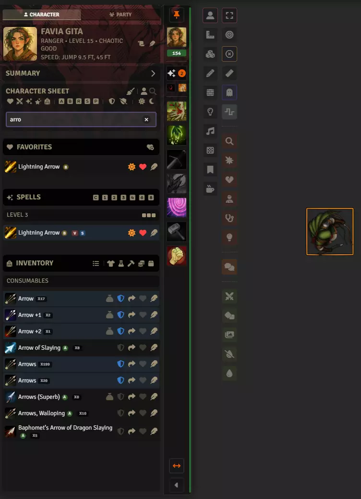

### Send an item to another character

Two ways, and they do the same thing.

- Click the share arrow on an inventory or weapon row. **Transfer Item** opens: a quantity slider
  reading Give and Keep at its ends, and the party underneath. Pick who gets it and confirm with
  **Transfer**. Your own character is listed but cannot be chosen.
- Or open the Party tab and drag the item onto a party member's card.

What happens next depends on **GM Approves Transfers**, which is the GM's setting for the whole world.
With it on, the request goes to the GM, who approves or denies it, and then to the recipient, who
accepts or rejects. Chat cards carry each step, and a request that nobody answers expires after
**Transfer Request Timeout**. With it off, characters you have permission over move things directly.

Coins work slightly differently. The send arrow on a currency row opens the same picker, but the move
needs write access to both characters -- so a GM can send coins from anyone to anyone, and a player
can move coins between two characters they own, but player to player does not work. The coins icon
next to it consolidates your money into the fewest pieces.

You cannot send a container that still has things in it. Empty it first.

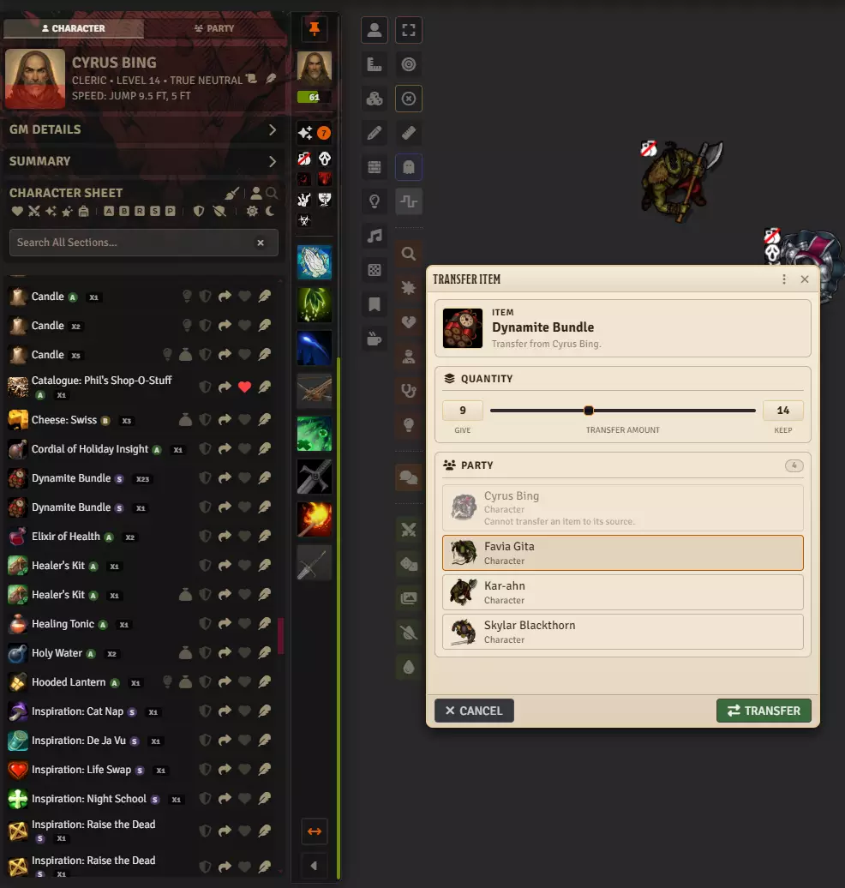

### Add something from a compendium

If the GM has allowed it, the Character Sheet strip carries a magnifying glass alongside the heart and
the person. Click it and the tabs, the filter bar and the panel stack are all replaced by a search box
and **Add from Compendiums**, listing matches grouped by the compendium they came from. Each row has a plus that adds it. The person icon next to the
magnifying glass goes back to the character's own items. Adding something switches to the tab that
will hold it, so you land on the new row rather than on whichever tab you happened to leave open.

**Let Players Use Compendiums** is the GM's setting and has four positions: off, look only, ask the GM
-- where adding sends a request to approve or deny -- and add freely. The GM can always search and add.

The tickbox directly under the search box, **Clear search and keep open on add**, decides what happens
after you add something: leave it ticked to stay in search and add several things, untick it to go back
to the character and land on the new item.

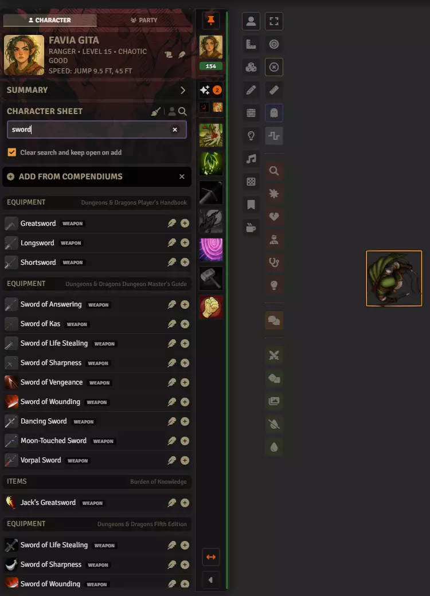

## Tidy up a character sheet

The broom on the Character Sheet strip opens Cleanup. It does three things, and it shows you the whole
plan before it does any of them:

- **Consolidate currency** into the fewest coins, with the total before and after so you can check
  that nothing changed but the shape of it.
- **Link items to their compendium entry**, so an item records what it is a copy of.
- **Merge duplicate stacks**, with anything it declined to merge explained in plain language, and one
  step of undo.

Every row can be unticked, and it reports what it did rather than closing behind a notification.

Read the warning in the window before you apply: **there is no undo** for the run as a whole, and it
tells you to duplicate the actor, or export its data from the sidebar, if you want a way back. The one
exception is the merge, which keeps a snapshot -- **Undo the Last Merge** appears at the top of the
window afterwards, with a **Restore** button, and it holds only the most recent one.

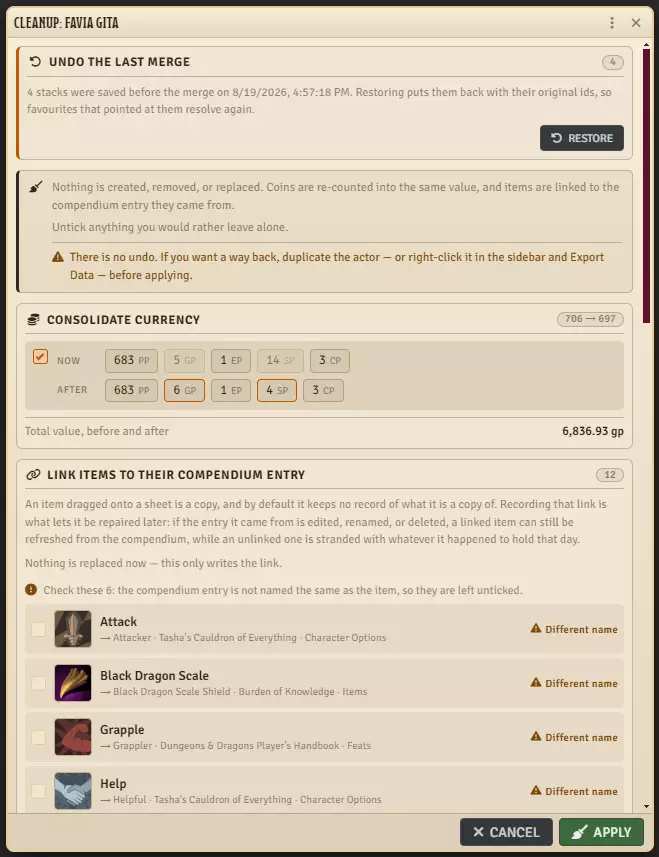

By default only the GM can run it. If the GM turns on **Players Can Request Cleanup**, a player can run
it on a character they own -- but applying sends the plan to the GM, who reviews the same rows in the
same window and decides. A player never writes to their own sheet this way.

## The Party tab

The Party tab lists everyone with a token on the current scene: player characters always, and for a GM
the other tokens too. Each card carries a portrait, the character's class, level and speed, a hit-point
bar, and a coloured disposition dot on anything that is not a friendly player character. The card for
the character the tray is showing is outlined.

The list is sorted, not in the order tokens were dropped on the scene: the living first, then the dead,
alphabetical within each. A character who drops to zero hit points sinks to the bottom of the list --
which is the point, because that is a change worth noticing. The GM's monster and NPC list under the
divider is sorted the same way.

**Party Health** sits above the cards: one bar totalling the party's current and maximum hit points, so
you can see how the group as a whole is doing without adding it up.

**Search Party**, below Party Health, filters the list down to the names that match what you type. It
matches on the name only, anywhere in it, and ignores capitals. **Escape** or the **x** in the box
clears it. Reputation, Party Health and the search box stay put while the list below them scrolls, so
you can keep typing however long the roster is.

Along the top:

- **Experience** -- GM only. Awards XP.
- **Select Party** -- selects the whole party for a GM, or the characters you own for a player.
- **Vote** -- starts a vote, for the GM and the party leader.
- **Deploy Party** and **Clear Party** -- puts every party member's token on the canvas, or takes them
  all off.

**Party Reputation** sits at the top. Reputation is stored per scene, so the card names the scene it
belongs to; the bar runs the whole range from hostile to friendly with a marker showing where the party
sits, rather than filling up like a progress bar. A GM gets four buttons -- **-5** and **-1** to the
left of the bar, **+1** and **+5** to its right.

**Lifetime MVP Leaderboard** is the Party Stats panel, off by default. It ranks players by total,
average, best and battles, and it needs Blacksmith's statistics to have anything to show.

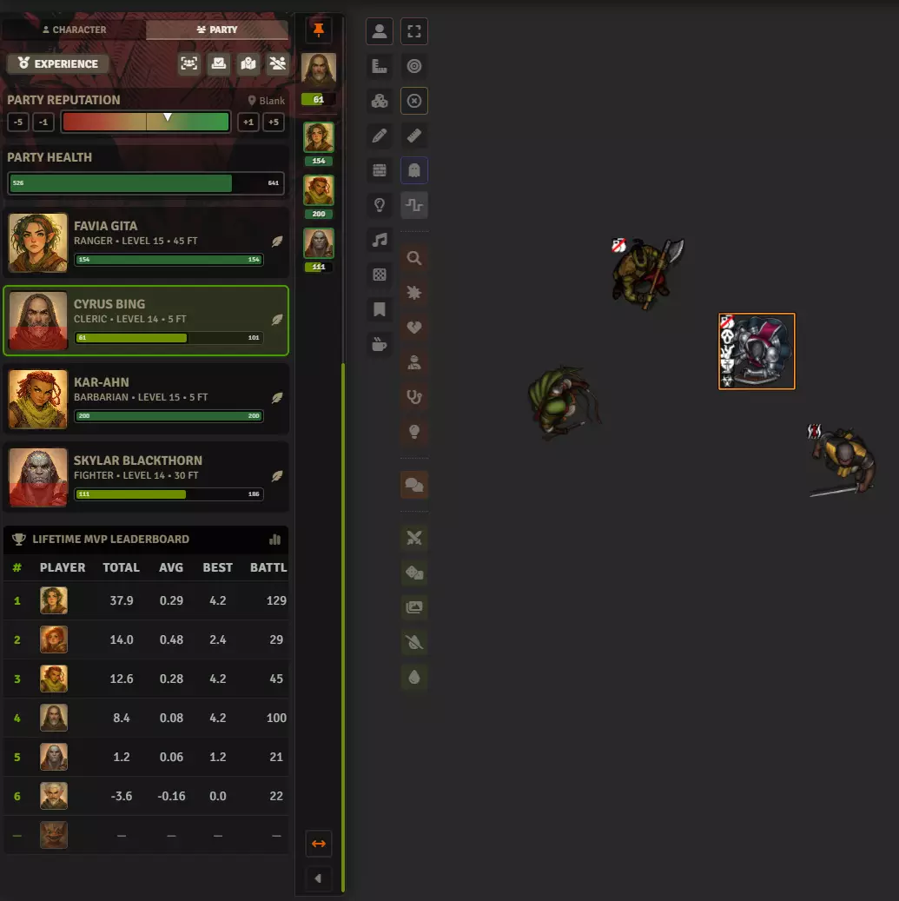

## Read or print a character sheet

The printer icon on the character panel builds a full sheet -- abilities, stats, saving throws,
languages, skills in two columns, and the biography -- and opens it in its own window. Read it there,
resize it, leave it open beside the tray.

**Print or Save as PDF** at the foot of that window hands the sheet to your browser's print dialog,
which is where saving a PDF lives as well as printing one. It prints the sheet rather than Foundry
around it.

Each character gets one window, so clicking the icon again brings the same one back rather than
stacking another on top. Two different characters get two windows.

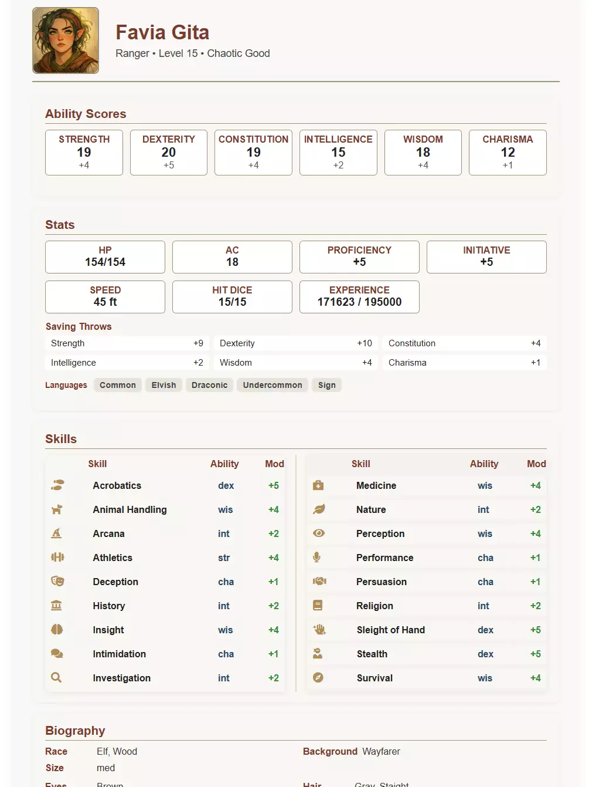

## Who can do what

| | GM | Player |
|---|---|---|
| Point the tray at a character | Selecting a token | Automatic, or the portrait chips |
| GM Details panel | Yes | Never, whatever the setting says |
| Run Cleanup | Yes | Only if the GM allows it, and only as a request |
| Add from a compendium | Always | Whatever **Let Players Use Compendiums** says |
| Send an item | Yes | Yes, through approval if the GM requires it |
| Send coins | Anyone to anyone | Only between characters they own |
| Award experience, deploy or clear the party | Yes | No |
| Start a vote | Yes | Party leader only |
| Adjust reputation | Yes | No |
| Repair an NPC statblock | Yes | No |

## Squire and the rest of the suite

Several things you reach through Squire are not Squire's. The Health window and the status effects
window belong to Blacksmith, and the handle simply opens them. The dice tray and macros are
Blacksmith's too, and they are reached from the Blacksmith menubar rather than from the handle,
because they are global tools that do not care which token you have selected.

Quests and the Codex are Coffee Pub Librarian's, and Notes are Blacksmith's. All three were Squire's
until 13.7.0, and the data was migrated rather than dropped.
